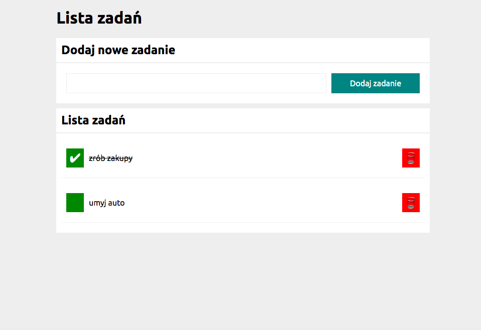

# Tasks List

## Table of content: 
* [ Preview the tasks list](#tasks-list)
* [ Basic Informations ](#basic-information) 
* [ Used Technologies](#used-technologies)
* [Usage](#usage)

## Preview the tasks list

[ Click here to make Your own tasks list](https://meggcreative.github.io/tasks-list/)

## Basic Informations

This project was created to make a simple example of using forms in JS and practice how we can use functions in JS. Moreover this project shows how exactly we can use media queries to change view for smaller receiveres like for example iphone.   

## Used Technologies
1. Semantic HTML
2. CSS
3. BEM convenction
4. Grid
5. ES6+ 

## Usage
1. Write down new task and add it by clicking into the button on the right side. 
2. Your task will add under the "Lista zadań".
3. If Your task is done You can click green button on the left, and then Your task will be crossed out.
4. If You want to remove your added task You can click red button on the right side, and Your task will disappear.